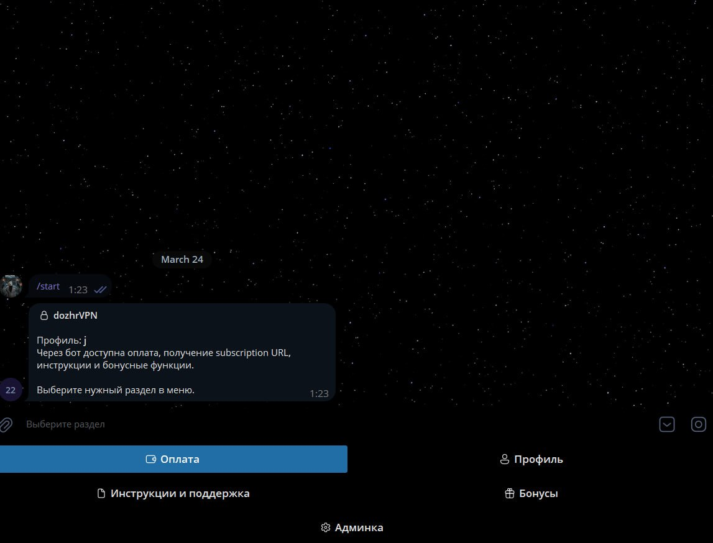
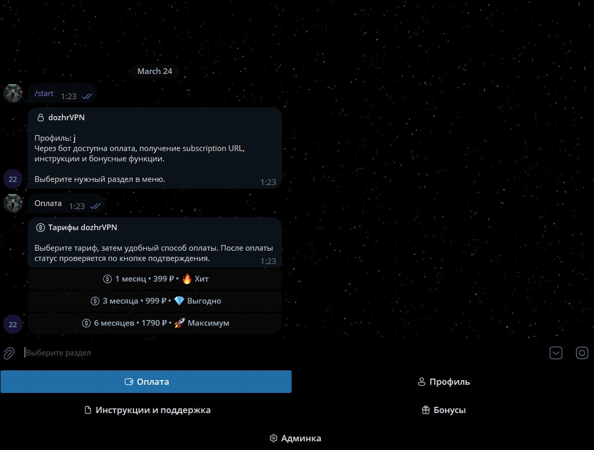
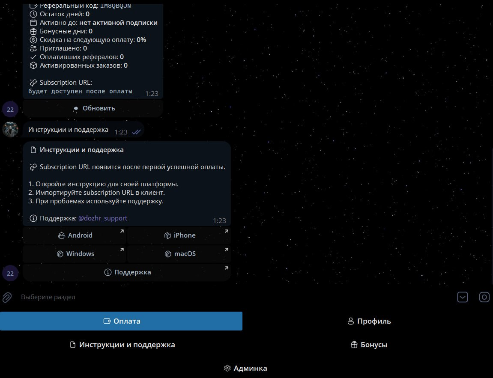
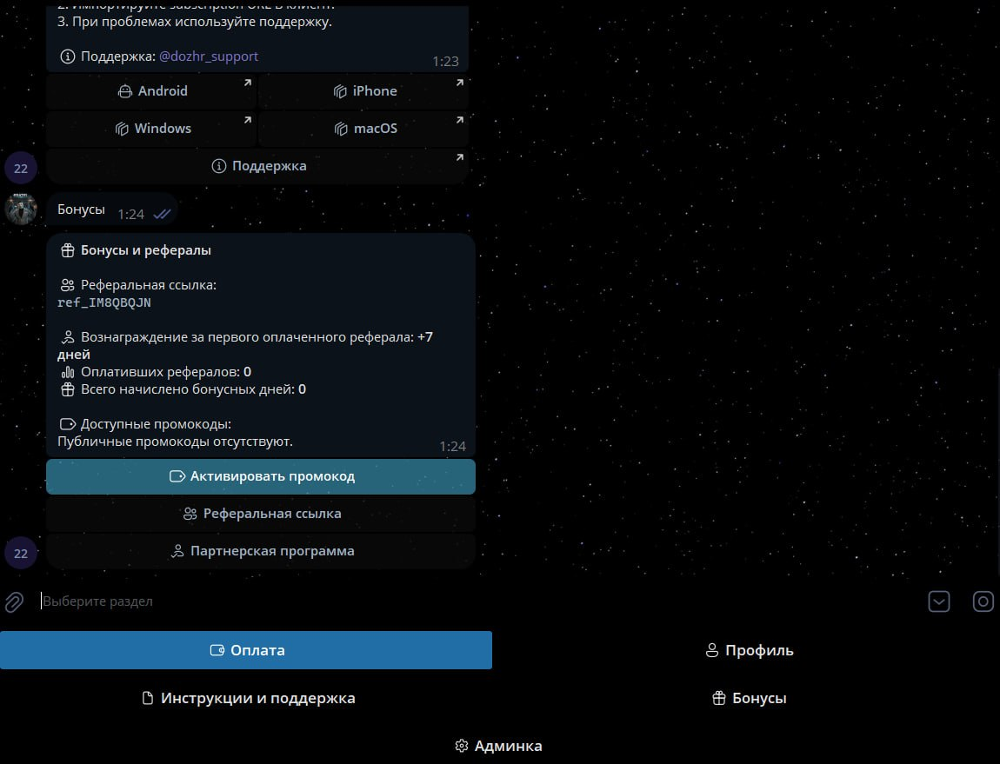
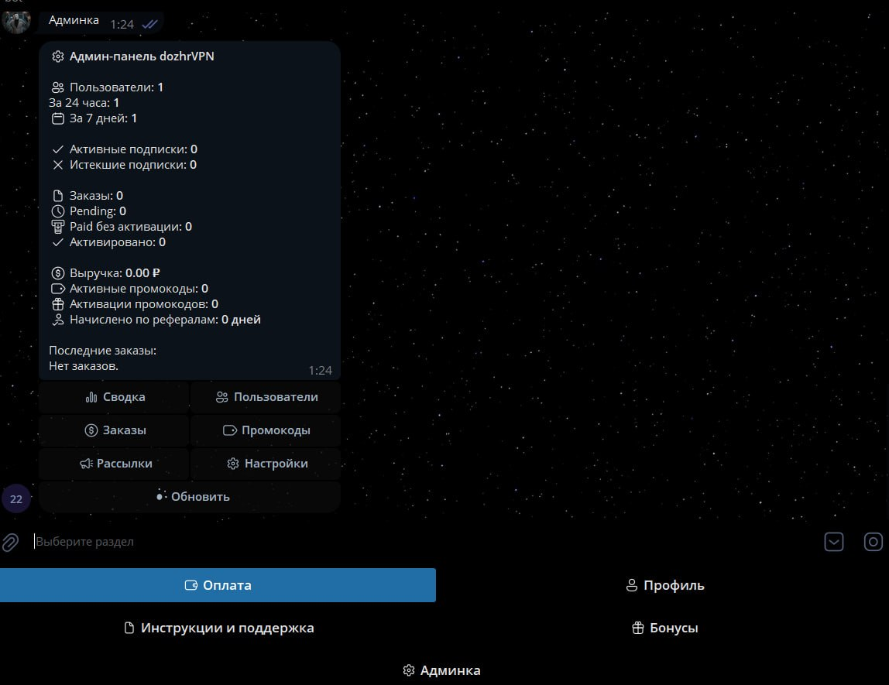
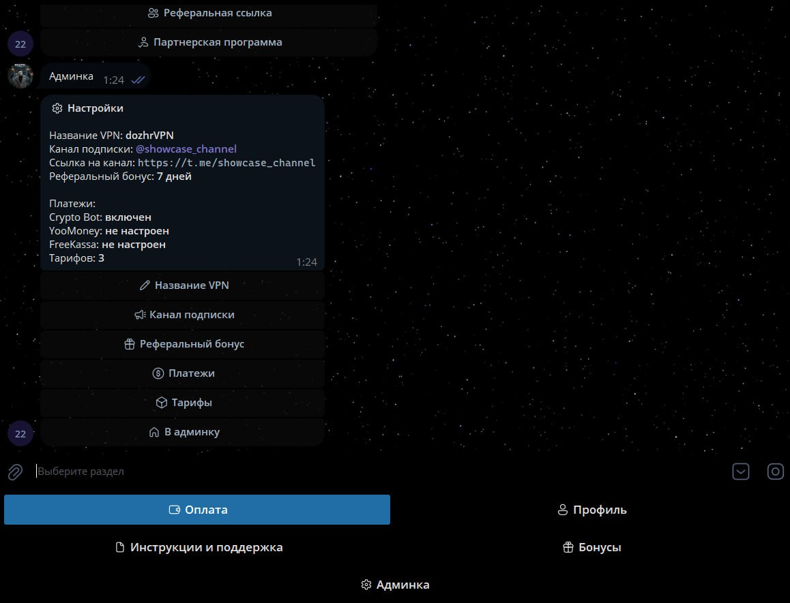
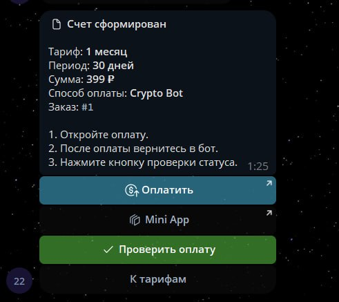

<h1 align="center">Remnawave Telegram Bot</h1>

<p align="center">
  Telegram-бот для продажи VPN-подписок с оплатой, админкой, промокодами, рефералкой и автоматической выдачей subscription URL через Remnawave.
</p>

<p align="center">
  
  
  
  
</p>

<p align="center">
  <a href="#screenshots">Скриншоты</a> •
  <a href="#features">Функционал</a> •
  <a href="#quick-start">Быстрый старт</a> •
  <a href="#configuration">Конфигурация</a> •
  <a href="#contacts">Контакты</a>
</p>

---

## Overview

Бот закрывает полный сценарий продажи VPN-подписки: пользователь запускает `/start`, проходит проверку подписки на канал, выбирает тариф, оплачивает удобным способом, а после подтверждения платежа получает subscription URL.

Локальная база хранит пользователей, заказы, промокоды, настройки, рассылки и состояние подписок. Remnawave отвечает за выдачу и продление доступа, а бот синхронизирует данные и аккуратно обрабатывает повторные оплаты, продления и неактивные счета.

## Screenshots

| Главное меню | Тарифы |
| --- | --- |
|  |  |

| Инструкции | Бонусы |
| --- | --- |
|  |  |

| Админ-панель | Настройки |
| --- | --- |
|  |  |

| Счет на оплату |
| --- |
|  |

## Features

| Блок | Что умеет |
| --- | --- |
| Продажа тарифов | Выбор плана, расчет стоимости, скидки и бонусные дни |
| Профиль | Остаток дней, дата окончания, реферальный код, subscription URL |
| Оплаты | Crypto Bot, YooMoney, FreeKassa, проверка статуса без вебхуков |
| Remnawave | Создание, продление и синхронизация подписок |
| Бонусы | Промокоды, скидки на следующую оплату, бонусные дни |
| Рефералка | Персональная ссылка и награда за первого оплатившего реферала |
| Инструкции | Отдельные ссылки для iOS, Android, Windows и macOS |
| Админка | Сводка, пользователи, заказы, промокоды, платежки и настройки |
| Рассылки | Ручные и автоматические кампании с медиа и URL-кнопками |

## Tech Stack

| Компонент | Технология |
| --- | --- |
| Bot framework | Python, Aiogram 3 |
| Database | PostgreSQL, psycopg |
| Payments | Crypto Bot, YooMoney, FreeKassa |
| VPN panel | Remnawave API |
| Runtime | Docker Compose или локальный Python |

## Project Structure

```text
.
├── dozhrvpn_bot/          # основной код бота
├── screenshots/           # скриншоты интерфейса
├── .env.example           # пример конфигурации
├── docker-compose.yml     # запуск бота и PostgreSQL
├── Dockerfile             # образ приложения
├── main.py                # точка входа
└── requirements.txt       # зависимости
```

## Quick Start

### Docker Compose

```bash
cp .env.example .env
docker compose up -d --build
docker compose logs -f bot
```

Для Windows PowerShell можно заменить первую команду:

```powershell
Copy-Item .env.example .env
```

Перед запуском заполните в `.env` как минимум `BOT_TOKEN`, `ADMIN_IDS`, `REQUIRED_CHANNEL_ID`, `REQUIRED_CHANNEL_URL`, `REMNAWAVE_BASE_URL` и данные для авторизации в Remnawave.

`docker-compose.yml` поднимает PostgreSQL и сам передает боту `DATABASE_URL`. Если нужен внешний PostgreSQL, укажите свой `DATABASE_URL` в `.env`.

### Local Run

```powershell
python -m venv .venv
.venv\Scripts\Activate.ps1
pip install -r requirements.txt
Copy-Item .env.example .env
python main.py
```

## Configuration

Обязательные переменные:

| Переменная | Назначение |
| --- | --- |
| `BOT_TOKEN` | Токен Telegram-бота |
| `ADMIN_IDS` | Telegram ID администраторов через запятую |
| `DATABASE_URL` | PostgreSQL DSN для локального запуска или внешней базы |
| `REQUIRED_CHANNEL_ID` | Канал для проверки подписки |
| `REQUIRED_CHANNEL_URL` | Публичная ссылка на канал |
| `REMNAWAVE_BASE_URL` | URL панели Remnawave |
| `REMNAWAVE_API_TOKEN` | API-токен Remnawave |
| `REMNAWAVE_LOGIN` / `REMNAWAVE_PASSWORD` | Альтернатива API-токену |

Минимум один платежный метод:

| Провайдер | Переменные |
| --- | --- |
| Crypto Bot | `CRYPTO_PAY_TOKEN` |
| YooMoney | `YOOMONEY_WALLET`, `YOOMONEY_TOKEN` |
| FreeKassa | `FREEKASSA_SHOP_ID`, `FREEKASSA_API_KEY`, `FREEKASSA_PAYMENT_SYSTEM_ID`, `FREEKASSA_PAYER_EMAIL` |

Пример DSN:

```env
DATABASE_URL=postgresql://<user>:<password>@127.0.0.1:5432/remnawave_tg_bot
```

Бот сам создает таблицы при старте.

## Contacts

Портфолио: [https://t.me/dozhr_portfolio](https://t.me/dozhr_portfolio)

Заказать разработку - [https://t.me/dozhr](https://t.me/dozhr)
